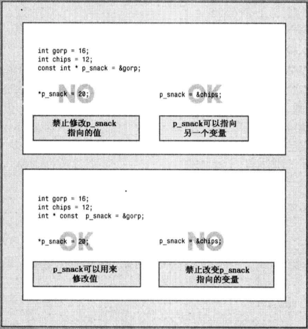

# C++笔记

## 1 预备知识

### 1.1 C语言编程原理

* 结构化编程
* 自顶向下

### 1.2 面向对象编程

* 与强调过程性编程相对的,OOP强调的是数据,本质是数据格式
* OOP编程将数据和方法合并为类定义
* 类定义了数据的存储和使用方式, 对象是类的特定实例

### 1.3 泛型编程

* 使重用代码和抽象通用概念的技术更简单
* OOP是一个管理大型项目的工具, 泛型编程提供了执行常见任务的工具

### 1.4 编程步骤


## 2 开始学习

### 2.1 命名空间

```c++
#include<iostream>

using namespace std;
using std::cout;
```

### 2.2 声明变量

> C++尽可能的在首次使用变量前声明它

### 2.3 C++两种发送消息的方法

* 使用类方法(本质上是函数调用)

* 重新定义运算符

  ```C++
  cin >> x;
  cout << "Hello";
  ```

### 2.4 函数

* 函数原型只描述函数接口

  ```c++
  double sqrt(double)		//function prototype
  double pow(double, double)
  ```

* 函数定义包含了函数的代码

* 库文件中包含函数的编译代码, 头文件中包含原型

### 2.5 函数访问命名空间std的四种方法


## 3 处理数据

### 3.1 初始化

> 如果知道变量的初始值应该是什么,则应当对它进行初始化。否则,可能会带来悬而未决的问题。

### 3.2 C++11初始化的方式

```c++
// 大括号初始化器
int emus{7};		// set emus to 7
int rheas = {12};	// set rheas to 12
int rocs = {};		// set rocs to 0
int psychics{};		// set psychics to 0

// 类型转换
int x = 66;
char c1 = {x};		//not allowed, 编译器不会跟踪变量

const int x = 66;
char c2 = {x};		//allowed
```

### 3.3 选择整数类型

> 如果知道变量可能表示的整数值大于16位的最大可能值, 则使用long.

### 3.4 字符类型

> C++对字符使用单引号, 对字符串使用双引号

### 3.5 const 限定符

```c++
// 创建格式
const typename = value;
// 在声明中进行初始化
```

### 3.6 C++11的校验表


### 3.7 强制类型转换

```c++
(typename) value	//C
typename (value)	//C++
```

## 4 复合类型

### 4.1 数组

#### 4.1.1 声明数组

```c++
typename arrayName[arraySize]	//arraySize不能是变量
```

#### 4.1.2 数组初始化

```c++
// 只有在定义数组时才能使用初始化, 也不能将一个数组赋给另外一个数组
int cards[4] = {1, 2, 3, 4};	// allowed
int hands[4];					// allowed
hands[4] = {1, 2, 3, 4};		// not allowed
hands = cards;					// not allowed

long totals = {0};				// all elements set to 0
short things[] = {1, 2, 3};		// 编译器自动计算为3个元素,不建议(偷懒)

// C++11特性
double earnings[3] {1.2e4, 1.6e4, 1.1e4};	// 省略 = 
unsigned int counts[10] = {};				// all elements set to 0
float balances[100]{};						// ditto

// 禁止缩窄转换
```

### 4.2 字符串

#### 4.2.1 C-字符串

```c++
char dog[3] = {'d', 'o', 'g'};			// 字符数组
char cat[4] = {'c', 'a', 't', '\0'};	// 字符串

// 字符串常量(string constant) 或 字符串面值(string literal)
char bird[10] = "Mr.Cheeps";			// 将空字符计算在内
char fish[] = "Bubbles";
strlen(fish);							// 只计算可见字符
```

> 数组长度不能低于`strlen()+1`
>
> `cin`使用空白来确定字符串的技术位置


#### 4.2.2 读取一行字符串

* `getline()`使用回车键输入的换行符确定结尾

  ```c++
  // 读入到包含20个元素的name数组中
  cin.getline(name, 20);
  // 最多读取19个字符
  ```

  

* `get()`

  ```c++
  cin.get(name, size);
  cin.get(dessert, size);
  // 第一次调用,换行符留在输入队列中, 在第二次调用时看到的第一个便是换行符.
  // 将无法跨过该换行符
  ```

  ```c++
  cin.get(name, size);
  cin.get();				
  cin.get(dessert, size);
  
  cin.get(name, size).get();		// 合并
  ```

* 输入混合字符串和数字

  ```c++
  cin >> year;
  char address[80];
  cin.getline(address, 80);
  // 无法输入地址,原因在于getline将换行符识别为空行,并将一个空字符串赋值给address数组.
  // 在读取address之前丢弃换行符
  cin >> year;
  cin.get();	// cin.get(ch);
  (cin >> year).get();
  ```


#### 4.2.3 String类

> 可以将String类声明为简单变量而不是数组
>
> 类设计让程序自动处理string的大小
>
> 使用string对象更方便和安全

```c++
#include<string>
string str = "panther";
```

#### 4.2.4 C++11字符串初始化

```c++
char first = {"This is the first!"};
string second = {"This is the second!"};
```

#### 4.2.5 赋值

```c++
char1 = char2;	//invalid
strcpy(char1, char2);
strcat(char1, char2);
str1 = str2;	//valid
str.size();
getline(cin, str); //???
```

### 4.3 结构

```c++
struct inflatanle
{
    char name[20];
    float volume;
    double price;
};							// standard 
==========================================================
struct inflatanle
{
    char name[20];
    float volume;
    double price;
} mr_smith, mr_jones;		// two perks variables 
==========================================================
struct inflatanle
{
    char name[20];
    float volume;
    double price;
} mr_smith = 
{
    "smith",
    6,
    5
};	
==========================================================
struct 						// no tag
{
    char name[20];
    float volume;
    double price;
}inflatanle;				// a structure variable 
// 以后无法创建该类型的的变量
```

#### 4.3.1 结构数组

```c++
inflatable guests[2] =
{
    {"Bambi", 0.5, 21.99},
    {"Godzilla", 2000, 565.99}
};
```

#### 4.3.2 局部声明和外部声明


#### 4.3.3 共用体

```c++
union id
{
    long id_num;
    char id_char[20];
} id_val;
==========================================================
union 
{
    long id_num;
    char id_char[20];
};							// 地址相同,视为两个成员
```

### 4.4 枚举

```c++
enum spectrum {red, blue, orange, green};
// 只定义了赋值运算符
spectrum band;
band = blue;
band++;					// invalid
band = red + blue;		// invalid
==========================================================
// 只使用常量, 而不创建枚举类型的变量
enum {red, blue, yellow};
```

### 4.5 指针

#### 4.5.1 指针初始化

```c++
int *p;
int* p;
int * p;
int* p1, p2;		// 一个指针和一个int变量
==========================================================
int higgens = 5;
int* pt = &higgens;	// 将pt的值设为&higgens
```

> 在解除指针引用之前, 将指针初始化为一个确定的、适当的地址。

```c++
int *pt;
pt = (int *)0xB8000000;
```

#### 4.5.2 使用new来分配内存

```c++
typename * pointer_name = new typename;
```

#### 4.5.3 使用delete来释放内存

```c++
// delete释放ps指向的内存,但不会删除指针ps本身
int* ps = new int;		// ok
delete ps;				// ok
delete ps;				// not ok
==========================================================
int jugs = 5;
int* pi = &jugs;
delete pi;				// not allowed, memory not allocated by new
```

#### 4.5.4 使用new创建动态数组

```c++
int * psome = new int[10];
delete [] psome;
psome[0];
psome[1];
```

> 数组名和指针的区别:
>
> 可以修改指针的值, 而数组名是常量

#### 4.5.5 数组的地址

``` c++
short tell[10];
cout << tell;		// &tell[0];			tell + 1
cout << &tell;		// 是一个20字节的内存地址	  &tell + 1
```

> `sizeof()`用于数组名时,将返回整个数组的长度(字节)

#### 4.5.6 指针和字符串

> 在`cout`和多数`c++`表达式中, `char`数组名、`char`指针以及用`" "`括起的字符串常量,
>
> 都被解释为字符串的第一个字符的地址

> 在将字符串读入程序时, 应使用已分配的内存地址.
>
> 可以是数组名,也可以使用new初始化的指针

> 一般来说, 给`cout`	提供一个指针,将打印地址, 
>
> 但如果是`char *`则将显示指向的字符串

```c++
(int *)ps;		// 显示地址
ps = new char[strlen(animal) + 1];	// 获得一个副本,分配内存,避免浪费
```

#### 4.5.7 指针结构

```c++
struct infaltable
{
    char name[20];
    float volume;
    double price;
};
// 两种访问变量的方式
cin.get(ps->name, 20);
cin >> (*ps).volume;
cin >> ps->price;
```

### 4.6 C++管理内存的方式

* 自动存储

  > 在函数内部定义的常规变量使用的自动存储空间, 称为自动变量(automatic variable)
  >
  > 实际上, 自动变量是一个局部变量, 作用域为包含它的代码块
  >
  > 自动变量常存储在**栈**中

* 静态存储

  > 整个程序执行期间否存在的存储方式, 有两种方式: 
  >
  > 1. 在函数外部定义它
  > 2. 使用`static`关键字

* 动态存储

  > `new`与`delete`. 
  >
  > 管理一个内存池, 称为自由存储空间或堆
  >
  > 可能导致自由存储区不连续,跟踪新分配的位置更困难

### 4.7 指针数组

```c++
const years * arp[3] = {&s1, &s2, &s3};
const years ** ppa = arp;
auto ppb = arp;
```

### 4.8 数组的替代品

* `vector`

  ```c++
  #include<vector>
  vector<int> vi;
  int n;
  cin >> n;
  vector<double> vd(n);		// 可以是常量也可以是变量
  ```

* `array`(C++11)

  ```c++
  // 对象的长度固定, 也使用栈(静态内存分配)
  #include<array>
  array<int, 5> ai;
  array<double, 4> ad = {1.2, 2.1, 3.43, 4.3};	// 不可以是变量
  ```

## 5 循环结构

### 5.1 比较C-风格字符串

```c++
strcmp(str1, str2);
```


### 5.2 比较string类字符串

### 5.3 基于范围的for循环(C++11)

```c++
// 对于数组、vector、array
double prices[3] = {1.2, 2.5, 3.1};
for (double x : prices)
{
    // statement
}
==========================================================
for (double &x : prices)
{
    // modify
}
==========================================================
for (int x : {1, 2, 3, 4, 5})
{
    // 基于范围和初始化列表
}
```

### 5.4 循环与文本输入

> 如何停止读取字符?
>
> 1. 使用哨兵字符

> `cin`在读取`char`时会忽略空格和换行符
>
> 解决方案: 使用`cin.get(char)`

```c++
int main()
{
    char ch;
    int count = 0;
    cout << "Enter characters; use \'#\' to quit: ";
    // cin.get(ch);
    // while (cin.fail() == false)
    // {
    //     cout << ch;
    //     ++count;
    //     cin.get(ch);
    // }
    while (cin.get(ch))
    {
        cout << ch;
        ++count;
    }
    cout << count << " characters!";	// 算\n
    return 0;
}
```

```c++
int main()
{
    int count = 0;
    cout << "Enter characters; use \'#\' to quit: ";
    int ch;
    while ((ch = cin.get()) != EOF)
    {
        cout.put(ch);       // cout.put(char(ch));
        ++count;
    }

    cout << endl
         << count << " characters!";
    return 0;
}
```

`cin.get()`和`cin.get(char)`


> 如果读取`int`值的程序输入一个过大的值,很多C++会将这个值截短为合适的大小, 并不会通知丢失的精度
>
> 解决方案: 可以使用`double`或`long long`类型

### 5.5 逻辑`AND`和`OR`

```c++
// 逻辑AND运算优先级大于逻辑OR
(age > 30 && age < 45) || weight > 300
// 要想或运算优先级提高使用括号
(age > 30 || age < 45) && weight > 300
```

### 5.6`cctype`字符函数


### 5.7 `switch`语句

> `switch`不是为了处理取值范围而设计的
>
> 每一个`case`标签必须是一个单独的值,
>
> 这个值必须是整数包括`char`

### 5.8 错误处理

```c++
while (!(cin >> golf[i]))
{
    cin.clear(); // reset input
    while (cin.get() != '\n')
        continue; // get rid of bad input
    cout << "Please enter a number: ";
}
```

### 5.9 `cout`和文本输出


```c++
#include<fstream>
ofstream outFile;
outFile.open("fish.txt");
double wt = 125.8;
outFile << wt;
outFile.close();
```

### 5.10 `cin`和读取文本文件


```c++
#include<fstream>
ifstream inFile;
inFile.open("bowling.txt");
double wt;
inFile >> wt;
char line[81];
inFile.getline(line, 81);
// 检查文件是否被正确打开
if (!inFile.is_open())
{
    exit(EXIT_FAILURE)
}
```

## 6 函数--C++的编程模块

### 6.1 函数定义

>  c++不能返回数组, 但可以是其它任何类型
>
> 虽然不能返回数组, 但可以将数组作为结构或对象组成部分来返回


### 6.2 原型

* 为什么需要原型

  > 原型描述了函数到编译器的接口，也就是说，它将函数返回值的类型(如果有的话）以及参数的类型和数量告诉编译器

* 为何编译器需要原型, 难道就不能在文件中进一步查找

  > 这种方法的一个问题是效率不高。编译器在搜索文件的剩余部分时将必须停止对main()的编译。一
  > 个更严重的问题是，函数甚至可能并不在文件中。C++允许将一个程序放在多个文件中，单独编译这些文件，然后再将它们组合起来。在这种情况下，编译器在编译main()时，可能无权访问函数代码。如果函数位于库中，情况也将如此。避免使用函数原型的唯一方法是，在首次使用函数之前定义它，但这并不总是可行的。另外，C++的编程风格是将main()放在最前面，因为它通常提供了程序的整体结构。

* 原型确保如下几点

  * 编译器正确处理函数返回值;
  * 编译器检查使用的参数数目是否正确;
  * 编译器检查使用的参数类型是否正确。如果不正确，则转换为正确的类型（如果可能的话)。

### 6.3 输入技巧

> 使用cin>>ch，而不是cin.get(ch)或ch=cin.get( )来读取一个字符。这样做是有原因的。前面讲过，这两
> 个cin.get()函数读取所有的输入字符，包括空格和换行符，而cin>>跳过空格和换行符。当用户对程序提示
> 作出响应时，必须在每行的最后按Enter键，以生成换行符。cin>>ch方法可以轻松地跳过这些换行符，但
> 当输入的下一个字符为数字时，cin.get()将读取后面的换行符。

```c++
while (n-- > 0)
    cout << c;
```

### 6.4 函数如何使用指针来处理数组

```c++
int sum_arr(int arr[]. int n);
int sum_arr(int * arr, int n);
// 当且仅当在函数头或函数原型中含义相同
arr[i] = *(arr + i);	// values in two notations
&arr[i] = arr + i;		// addresses in two notations
```

```c++
// 为将数组类型和元素数量告诉数组处理函数, 通过两个不同的参数来传递
void fill_array(int arr[], int size);
// 不要试图使用下列形式
void fii_array(int arr[size]);
```

### 6.5 const

* 保护数组

    ```c++
    // 为防止函数无意间修改数组内容, 在形参声明时使用const
    void show_array(const double arr[], int n);
    ```

* 指针

  ```c++
  // 第一种让指针指向一个常量对象,这样可以防止使用该指针来修改所指向的值
  // 第二种将指针本身声明为常量,这样防止改变指针指向的位置
  ==========================================================
  int age = 39;
  const int * pt = &age;
  // pt指向一个const int, 不能使用pt来修改这个值
  // 但可以直接修改age
  age += 1;
  ==========================================================
  // c++禁止将const的地址赋给非const的指针			const_cast??
  const float g_moon = 1.63;
  float * pm = &g_moon;		// invalid
  ==========================================================
  ```

* 尽可能使用const

  * 这样可以避免由于无意间修改数据而导致的编程错误

  * 使用const使得函数能够处理const和非const实参, 否则将只能接受非const数据

    ```c++
    // 为说明另一个微妙之处，请看下面的声明:
    int age = 39;
    const int * pt = &age;
    // 第二个声明中的const只能防止修改pt指向的值（这里为39)，而不能防止修改pt的值。也就是说，可以将一个新地址赋给pt:
    int sage = 80;
    pt = &sage; // okay to point to another location
    // 但仍然不能使用pt来修改它指向的值（现在为80)。第二种使用const的方式使得无法修改指针的值:
    int sloth = 3 ;
    const int * ps = &sloth;		// a pointer to const int
    int * const finger = &sloth;	// a const pointer to int
    // 在最后一个声明中，关键字const的位置与以前不同。这种声明格式使得finger只能指向sloth，但允许使用finger来修改sloth的值。中间的声明不允许使用ps 来修改sloth的值，但允许将ps 指向另一个位置。简而言之，finger和*ps都是const，而*finger和ps不是。
    ```

    

### 6.6 函数和二维数组

```c++
int data[3][4] = {
    {1, 2, 3, 4},
    {1, 2, 3, 4},
    {1, 2, 3, 4}
};
int total = sum(data, 3);
// sum的函数原型,指向由4个int组成的数组的指针
int sum(int (*arr)[4], int size);

// 4个指向int的指针组成的数组
int * arr[4];

// 另一种格式
int sum(int arr[][4], int size);
// 两种格式对于行数没有限制

arr[i][j] == *(*(arr + i) + j)
```

### 6.7 函数和C-风格字符串

表示字符串的方式有三种

* char数组
* 引号括起的字符串常量(字符串字面值)
* 被设置为字符串的地址的char指针

> 实际传递的是字符串第一个字符的地址, 
>
> 函数原型应将形参声明为char* 类型

[strgfun.cpp](C:\Users\pan\Desktop\Projects\HelloWorld\C++PrimerPlus\middle\strgfun.cpp)

```c++
// 处理字符串的标准方式
while (*str)			// 空值字符的数字编码为0
{
    if (*str == ch)
        ++count;
    str++;
}
```

返回C-风格字符串的函数

```c++
char *buildstr(char c, int n)
{
    char *pstr = new char[n + 1];
    *(pstr + n) = '\0';
    while (n-- > 0)
        *(pstr + n) = c;
    return pstr;
}
```

### 6.8 函数指针

1. 获取函数的地址

   ```c++
   process(think);		// 使用函数名
   ```

2. 声明函数指针

   ```c++
   double pam(int);	// prototype
   double (*pf)(int);	// pf是一个指向函数的指针
   pf = pam;
   
   double * pf(int);	// 返回指针的函数
   
   void estimate(int lines, double (*pf)(int));
   ```

3. 使用指针来调用函数

   ```c++
   double x = pam(4);
   double y = (*pf)(5);
   ```

## 7 函数探幽

### 7.1 内联函数

> 内联函数的编译代码与其他程序代码“内联”起来了。也就是说，编译器将使用相应的函数代码替换函数调用。对于内联代码，程序无需跳到另一个位置处执行代码，再跳回来。
> 因此，内联函数的运行速度比常规函数稍快，但代价是需要占用更多内存。
> 如果程序在10个不同的地方调用同一个内联函数，则该程序将包含该函数代码的10个副本。

要使用这项特性，必须采取下述措施之一:

* 在函数声明前加上关键字inline;

* 在函数定义前加上关键字inline。

通常的做法是省略原型，将整个定义(即函数头和所有函数代码）放在本应提供原型的地方。

### 7.2 引用变量

引用是已定义的变量的别名。

主要用途是用作函数的形参。

```c++
int rats;
int & rodents = rats;
```

